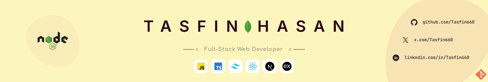

### 🙌 Hi, I'm Tasfin

I’m an engineering student and a Full Stack developer. I love building web applications that are modern, scalable, and easy to use. I’m always learning and staying curious about new tech.

> Open to exciting collaborations and opportunities

#### Core Languages&nbsp;↓

#### Still curious? Get to know me
###### -- Say Hi → [Gmail](mailto:tasfinhasan660@gmail.com) -- Connect → [LinkedIn](https://linkedin.com/in/Tasfin660)  -- Explore designs → [Dribbble](https://dribbble.com/Tasfin660) -- View projects → [YouTube](https://www.youtube.com/@tasfin660) -- Hang out and chat → [Discord](https://discord.com/users/513693207880663040)

##### Most used languages

Updated: December 2025
